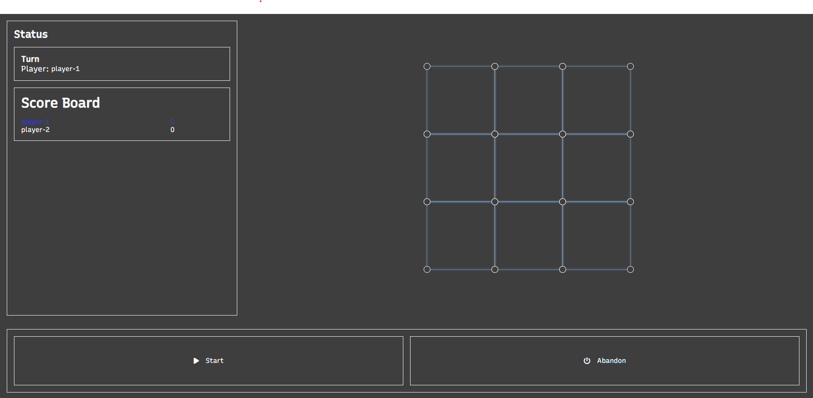

# Property Hadap
This is a simple hobby project, a game made with React.

### Game Rules
- The objective of the game is to capture most tiles on the board.
- A tile is capture when all four of its edges are selected.
- Any number of players can play together in a game.
- Every player in the game gets a turn in round-robin fashion.
- Each player gets to select any one unselected edge on the board.
- On selection, if the selected edge is a part of now captured tile, the player earns one point and one extra move.
- When all tiles are captured, player with the most tiles captured is the winner!



# Installation / Setup
- Clone repo
```bash
git clone https://github.com/EyeZen/PropertyHadap.git
```

- Install dependencies
```bash
npm install
```

- Start development server
```bash
npm run dev
```

- Done 👍


# Future Plans
<p>A list of things that I want to incorporate into this project!</p>
<ul>
    <li>Clean UI</li>
    <li>Add support for multiple-device multiplayer system</li>
    <li>Maybe convert it into a micro-frontend</li>
</ul> 